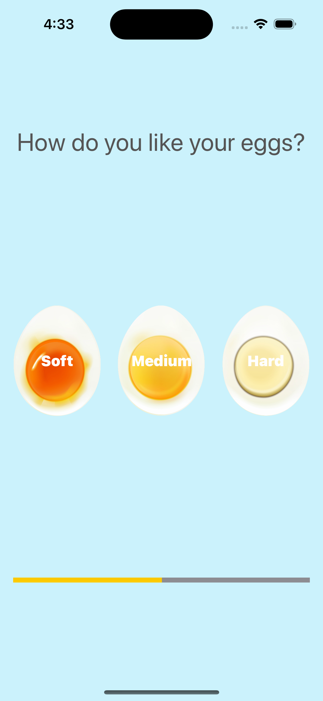

# Egg Timer

## About

Beautiful egg timer app to boil your eggs to perfection depending on how you prefer your eggs. 

## Swift Use case

* Swift Collection types - Dictionaries
* The Swift Timer API
* Conditional statements - IF/ELSE
* Conditional statements - Switch
* Functions with outputs
* How to use the ProgressView

>This is a companion project to The App Brewery's Complete App Development Bootcamp, check out the full course at [www.appbrewery.co](https://www.appbrewery.co/)

